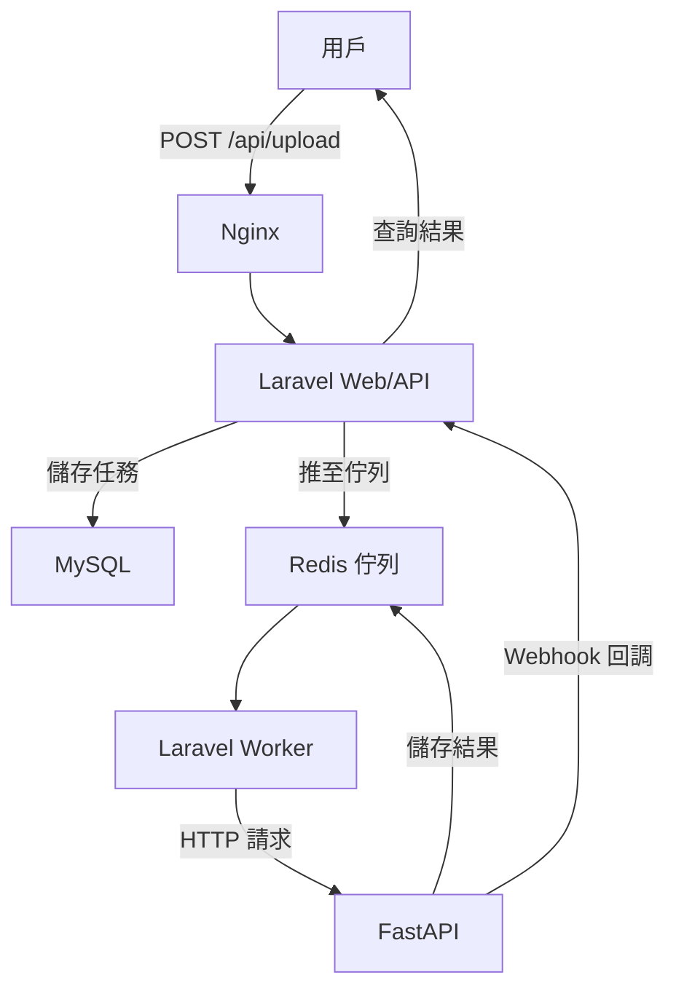

# InsightForge 🧠🔥

[](https://github.com/BpsEason/InsightForge/actions)
[](https://opensource.org/licenses/MIT)
[](https://hub.docker.com/r/yourusername/insightforge)

**InsightForge** 是一個高效的 **AI 驅動數據分析平台**，採用 **Laravel + FastAPI** 微服務架構，結合 **Redis** 佇列與快取，實現模組化任務處理與即時分析。平台設計注重 **解耦**、**高性能** 與 **可擴展性**，適用於智能客服、推薦系統、金融風控等企業級應用。

> **GitHub 描述**：Modular AI analysis platform built with Laravel + FastAPI. Queue-powered, cache-accelerated, and production-ready.

---

## 🌟 專案亮點

- **微服務解耦**：Laravel 負責業務邏輯與 API，FastAPI 專注 AI 推論，獨立開發與部署。
- **異步高效**：Redis 佇列削峰填谷，支援高併發任務。
- **即時快取**：Redis 儲存任務狀態與結果，TTL 自動清理，降低資料庫壓力。
- **安全保障**：HMAC 簽名驗證 Webhook，Docker 網路隔離，確保通訊安全。
- **容器化部署**：Docker Compose 提供環境一致性，支援快速擴展。
- **自動化 CI/CD**：GitHub Actions 實現測試與部署，加速迭代。

---

## 🧱 系統架構圖



---

## ⚙️ 關鍵技術與設計決策

- **Laravel 10**：RESTful API、任務管理、MySQL 持久化，負責業務邏輯。
- **FastAPI**：異步 AI 推論，Pydantic 驗證，支援 Webhook 回調。
- **Redis**：佇列（異步任務）與快取（任務狀態，TTL 100 秒），提升性能。
- **MySQL**：儲存任務、結果與日誌，支援追蹤。
- **Nginx**：反向代理，統一流量入口，增強安全。
- **Docker Compose**：容器編排，確保環境一致。
- **GitHub Actions**：自動化測試與映像推送。

**技術選型**：
- **Laravel + FastAPI**：Laravel 擅長 Web 應用，FastAPI 與 Python AI 生態相容，實現分工解耦。挑戰在於跨語言通訊與運維複雜度。
- **Redis**：支援高併發，無 Redis 將導致阻塞與資料庫壓力。
- **Docker**：提供環境一致性與隔離，簡化部署。

**角色分工**：
- Laravel：API 入口、任務創建、資料持久化、Webhook 接收。
- FastAPI：AI 推論、結果快取、Webhook 回調。
- 協作：Redis 佇列與 Webhook 實現異步通訊，HMAC 簽名確保安全。

---

## 🚀 業界應用場景

1. **數據分析**：處理銷售數據，生成洞察報告。
2. **智能客服**：NLP 支援意圖識別與問答。
3. **推薦系統**：實時生成個性化推薦。
4. **圖像分析**：執行物體檢測、人臉識別。
5. **金融風控**：分析交易，識別詐騙。
6. **IoT 維護**：預測設備故障，觸發工單。

---

## 🚀 快速啟動

### 前置需求
- Docker & Docker Compose
- Composer
- Python 3.9+
- Git

### 一鍵部署
運行自定腳本，自動完成環境設置與容器啟動：
```bash
chmod +x bin/setup.sh
./bin/setup.sh
```

### 手動設置

1. **克隆專案**：
   ```bash
   git clone https://github.com/BpsEason/InsightForge.git
   cd InsightForge
   ```

2. **初始化 Laravel**：
   ```bash
   cd laravel-app
   composer install
   cp .env.example .env
   php artisan key:generate
   ```

3. **初始化 FastAPI**：
   ```bash
   cd ../ai-service
   python -m venv venv
   source venv/bin/activate  # Windows: venv\Scripts\activate
   pip install -r requirements.txt
   ```

4. **配置環境變數**：
   - 編輯 `laravel-app/.env` 和 `ai-service/.env`：
     - `APP_KEY`：運行 `php artisan key:generate`
     - `LARAVEL_WEBHOOK_SECRET`：設置一致的 Webhook 密鑰
     - `yourusername`：替換 Docker Hub 用戶名
     - 確保 `REDIS_HOST=redis`, `DB_HOST=db`

5. **啟動容器**：
   ```bash
   cd ..
   docker-compose build
   docker-compose up -d
   ```

6. **執行遷移**：
   ```bash
   docker-compose exec laravel-app php artisan migrate
   ```

7. **訪問**：
   - API：`http://localhost/api/health`
   - FastAPI 文檔：`http://localhost/fastapi/docs`

---

## 🔄 任務處理流程

1. **上傳資料**：POST `/api/data/upload`，Laravel 驗證 JSON，創建 `AnalysisTask`（UUID），推至 Redis 佇列。
2. **任務執行**：`Laravel Worker` 監聽佇列，調用 FastAPI `/analyze`。
3. **AI 推論**：FastAPI 執行模擬模型，結果存 Redis（TTL 100 秒），Webhook 回調 Laravel。
4. **結果儲存**：Laravel 驗證簽名，更新 MySQL（`AnalysisTask` 與 `AnalysisResult`）。

**數據流**：用戶 → Laravel (MySQL) → Redis → FastAPI (Redis) → Laravel (MySQL)。  
**控制流**：同步（HTTP/Webhook），異步（佇列/推論）。

---

## 📁 目錄結構

```
InsightForge/
├── laravel-app/
│   ├── app/Controllers/Api/DataUploadController.php
│   ├── app/Jobs/ProcessAnalysisTask.php
│   ├── database/migrations/
│   ├── routes/api.php
│   ├── .env.example
│   └── Dockerfile
├── ai-service/
│   ├── main.py
│   ├── model/your_model.py
│   ├── tests/
│   ├── .env.example
│   └── Dockerfile
├── bin/
│   └── setup.sh
├── nginx/nginx.conf
├── docker-compose.yml
└── .github/workflows/ci.yml
```

---

## 🔑 關鍵代碼

### Laravel：資料上傳
```php
// laravel-app/app/Http/Controllers/Api/DataUploadController.php
<?php
namespace App\Http\Controllers\Api;

use App\Http\Controllers\Controller;
use Illuminate\Http\Request;
use App\Models\AnalysisTask;
use App\Jobs\ProcessAnalysisTask;
use Illuminate\Support\Str;

class DataUploadController extends Controller
{
    // 處理用戶上傳，創建任務並推至佇列
    public function upload(Request $request)
    {
        // 驗證輸入資料與任務類型
        $request->validate([
            'data' => 'required|json',
            'task_type' => 'required|string|in:sentiment_analysis,named_entity_recognition',
            'model_version' => 'required|string',
        ]);

        // 創建任務，生成唯一 UUID
        $task = AnalysisTask::create([
            'task_id' => (string) Str::uuid(),
            'task_type' => $request->task_type,
            'data_payload' => $request->data,
            'model_version' => $request->model_version,
            'status' => 'pending',
        ]);

        // 分發至 Redis 佇列
        ProcessAnalysisTask::dispatch($task);
        return response()->json(['message' => '任務已接收', 'task_id' => $task->task_id], 202);
    }
}
```

### FastAPI：任務處理
```python
# ai-service/main.py
from fastapi import FastAPI, HTTPException
from pydantic import BaseModel
import redis, json, requests, hmac, hashlib, asyncio
from dotenv import load_dotenv
import os, logging

# 配置日誌與環境變數
logging.basicConfig(level=logging.INFO)
logger = logging.getLogger(__name__)
load_dotenv()
app = FastAPI()

# 初始化 Redis
redis_client = redis.StrictRedis(host=os.getenv('REDIS_HOST', 'redis'), port=6379, decode_responses=True)

# 模擬 AI 模型
class MockAIModel:
    async def predict(self, data_payload: dict, task_type: str) -> dict:
        # 模擬情感分析，檢查文本關鍵字
        text = data_payload.get('text', '')
        if task_type == 'sentiment_analysis':
            sentiment = 'Positive' if '好' in text else 'Neutral'
            return {'sentiment': sentiment, 'score': 0.95}
        return {}

# 請求模型
class AnalyzeRequest(BaseModel):
    task_id: str
    data: str
    task_type: str
    model_version: str
    webhook_url: str
    webhook_secret: str | None

mock_model = MockAIModel()

# 處理分析任務
@app.post("/analyze")
async def analyze_task(request: AnalyzeRequest):
    # 儲存任務狀態至 Redis，設置 TTL
    redis_client.hmset(f"task:{request.task_id}", {'status': 'processing', 'data': request.data})
    redis_client.expire(f"task:{request.task_id}", 100)

    try:
        # 解析輸入並執行 AI 推論
        data_json = json.loads(request.data)
        result = await mock_model.predict(data_json, request.task_type)
        redis_client.hmset(f"task:{request.task_id}", {'status': 'completed', 'result': json.dumps(result)})

        # Webhook 回調，帶 HMAC 簽名
        payload = {'task_id': request.task_id, 'status': 'completed', 'result': result}
        headers = {'Content-Type': 'application/json'}
        if request.webhook_secret:
            signature = hmac.new(request.webhook_secret.encode(), json.dumps(payload).encode(), hashlib.sha256).hexdigest()
            headers['X-Webhook-Signature'] = signature
        requests.post(request.webhook_url, json=payload, headers=headers)
    except Exception as e:
        # 記錄錯誤至 Redis 與日誌
        redis_client.hmset(f"task:{request.task_id}", {'status': 'failed', 'error': str(e)})
        logger.error(f"Task {request.task_id} failed: {e}")

    return {'message': '任務處理中', 'task_id': request.task_id}
```

---

## 📜 API 文件與測試

### Swagger 文檔
FastAPI 提供內建 Swagger UI，訪問 `http://localhost/fastapi/docs` 查看 `/analyze` 端點詳情：
- **POST /analyze**：接收任務資料，執行 AI 推論，返回任務 ID。

### Postman 測試示例
1. **上傳任務**：
   ```bash
   curl -X POST http://localhost/api/data/upload \
   -H "Content-Type: application/json" \
   -d '{"data":"{\"text\":\"好消息！\"}","task_type":"sentiment_analysis","model_version":"v1.0"}'
   ```
   回應：
   ```json
   {"message":"任務已接收","task_id":"uuid"}
   ```

2. **查詢結果**：
   - 透過 Redis 或 MySQL 查詢任務狀態（未來可實現 `/api/result/{task_id}`）。
   - FastAPI Webhook 回調自動更新 MySQL。

**測試流程**：
- 使用 Postman 發送 `/api/data/upload` 請求，觀察 Redis 佇列（`docker-compose logs laravel-worker`）。
- 檢查 FastAPI 日誌（`docker-compose logs ai-service`），確認推論完成。
- 驗證 MySQL `analysis_tasks` 表，確保狀態更新。

---

## 🛠️ 技術細節

- **任務可靠性**：`ProcessAnalysisTask` Job 支援 3 次重試與 120 秒超時，記錄 `TaskLog` 確保追蹤。
- **資料驗證與安全**：FastAPI 使用 Pydantic 驗證，HMAC 簽名保護 Webhook，Docker 網路隔離限制訪問。
- **模型管理**：模擬模型（`MockAIModel`）支援簡單推論，未來可動態載入真實模型（如 Transformers）：
  ```python
  model_instances = {"v1.0": RealAIModel("v1.0"), "v1.1": RealAIModel("v1.1")}
  ```
- **Docker 配置**：`depends_on` 與 `healthcheck` 確保啟動順序，Nginx 提供負載均衡與安全防護。

---

## ❓ 常見問題解答

1. **如何生成 `APP_KEY`？**
   ```bash
   cd laravel-app
   php artisan key:generate
   ```

2. **FastAPI 500 錯誤？**
   - 檢查 `ai-service/.env` 的 `REDIS_HOST=redis`。
   - 確認 Redis 運行：`docker-compose ps`。
   - 查看日誌：`docker-compose logs ai-service`。

3. **Worker 不處理任務？**
   - 確保 `laravel-app/.env` 的 `QUEUE_CONNECTION=redis`。
   - 查看日誌：`docker-compose logs laravel-worker`。

4. **測試 API？**
   - 參見「API 文件與測試」中的 Postman 示例。

5. **擴展模型？**
   - 修改 `ai-service/model/your_model.py`，實現真實模型。
   - 更新 `requirements.txt`（如 `transformers`、`torch`）。

---

## 💡 性能與擴展

- **任務激增**：
  - Redis 佇列緩衝，支援削峰填谷。
  - 擴展容器：`docker-compose scale laravel-worker=3 ai-service=2`。
  - Nginx 負載均衡：
    ```nginx
    upstream fastapi_servers {
        server ai-service-1:8001;
        server ai-service-2:8001;
    }
    ```
- **模型更新**：藍綠部署，動態載入新模型，確保無停機。
- **監控**：Prometheus + Grafana，關注 API 響應時間、佇列長度、CPU/記憶體。
- **異常處理**：
  - Job 重試（3 次）、超時（120 秒）。
  - Redis 快取結果，支援查詢。
  - Laravel 事務確保一致性：
    ```php
    DB::transaction(function () use ($task, $request) {
        $task->update([...]);
        AnalysisResult::create([...]);
    });
    ```
- **安全措施**：
  - OAuth2/JWT 認證保護 API。
  - TLS 加密，Nginx 速率限制。
  - 敏感資料存於 `.env`，資料庫欄位加密。

---

## 📈 未來展望

- **功能擴展**：
  - WebSocket 即時通知（Laravel Reverb）。
  - Vue + ECharts 儀表板展示結果。
- **雲部署**：
  - AWS ECS/EKS，RDS（MySQL）+ ElastiCache（Redis），Auto Scaling。
  - GitHub Actions 推送映像至 ECR。
- **模型管理**：
  - A/B 測試，整合 MLflow 管理模型。
  - 動態載入模型，減少記憶體開銷。
- **新功能開發**：
  - 新增模型（如文本分類），流程：
    1. 更新 `ai-service/model/your_model.py`（如 BERT）。
    2. 修改 FastAPI `task_type` 與 Laravel 驗證。
    3. 測試並部署。

**雲部署示例**：
```yaml
# ECS Task Definition
services:
  laravel-app:
    image: yourusername/insightforge-laravel:latest
    environment:
      - REDIS_HOST=elasticache.redis
      - DB_HOST=rds.mysql
  ai-service:
    image: yourusername/insightforge-ai:latest
```

---

## 📜 授權

MIT License © BpsEason | InsightForge 2025+
