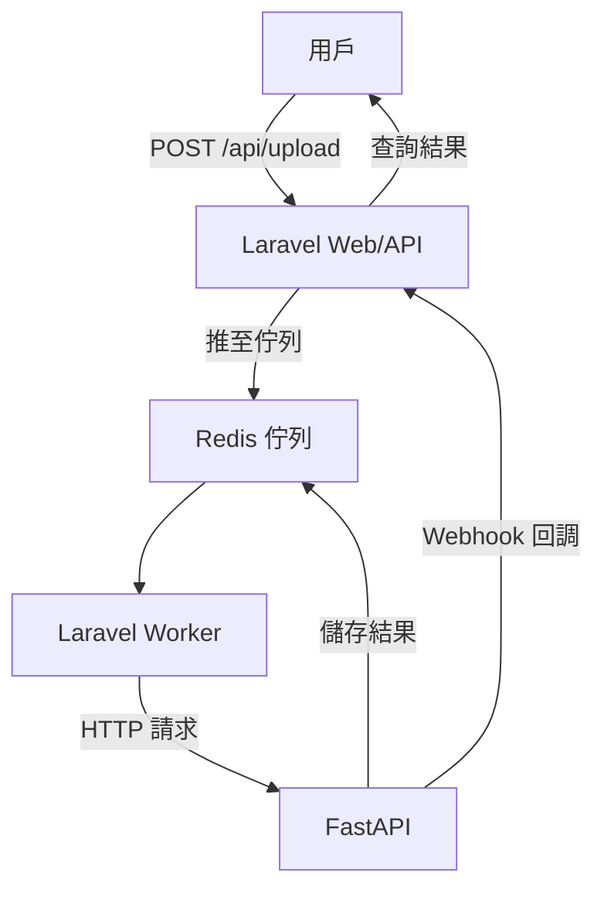

# InsightForge 🧠🔥

[](https://github.com/BpsEason/InsightForge/actions)
[](https://opensource.org/licenses/MIT)
[](https://hub.docker.com/r/yourusername/insightforge)

**InsightForge** 是一個高效的 **AI 驅動數據分析平台**，採用 **Laravel + FastAPI** 微服務架構，結合 **Redis** 佇列與快取，實現模組化任務處理與即時分析。平台設計注重 **解耦**、**高性能** 與 **可擴展性**，適用於智能客服、推薦系統、金融風控等企業級應用。

> **GitHub 描述**：Modular AI analysis platform built with Laravel + FastAPI. Queue-powered, cache-accelerated, and production-ready.

---

## 🌟 專案亮點

- **微服務解耦**：Laravel 負責業務邏輯與 API，FastAPI 專注 AI 推論，獨立開發與部署。
- **異步高效**：Redis 佇列削峰填谷，支援高併發任務。
- **即時快取**：Redis 儲存任務狀態與結果，TTL 自動清理，降低壓力。
- **安全保障**：HMAC 簽名驗證 Webhook，支援網路隔離。
- **容器化支援**：核心代碼兼容 Docker，環境一致。
- **自動化 CI/CD**：GitHub Actions 實現測試與部署。

---

## 🧱 系統架構圖



---

## ⚙️ 關鍵技術與設計決策

- **Laravel 10**：RESTful API、任務管理，負責業務邏輯。
- **FastAPI**：異步 AI 推論，Pydantic 驗證，支援 Webhook 回調。
- **Redis**：佇列（異步任務）與快取（任務狀態，TTL 100 秒）。
- **安全**：HMAC 簽名保護 Webhook，支援 OAuth2/JWT。
- **CI/CD**：GitHub Actions 自動化測試。

**技術選型**：
- **Laravel + FastAPI**：Laravel 擅長 Web，FastAPI 與 Python AI 生態相容。
- **Redis**：支援高併發，無 Redis 將導致阻塞。
- **角色分工**：
  - Laravel：API 入口、任務創建、Webhook 接收。
  - FastAPI：AI 推論、結果快取、Webhook 回調。
  - 協作：Redis 佇列與 Webhook 實現異步通訊。

---

## 🚀 業界應用場景

1. **數據分析**：生成銷售洞察報告。
2. **智能客服**：NLP 支援問答。
3. **推薦系統**：實時個性化推薦。
4. **圖像分析**：物體檢測、人臉識別。
5. **金融風控**：交易詐騙識別。
6. **IoT 維護**：設備故障預測。

---

## 🚀 快速啟動

> **注意**：本專案僅包含核心代碼（`laravel-app` 和 `ai-service`）。需自行設置 Redis 並安裝依賴。

### 前置需求
- PHP 8.2+ 與 Composer
- Python 3.9+ 與 pip
- Redis 6.2+（本地或 Docker）
- Git

### 設置步驟

1. **克隆專案**：
   ```bash
   git clone https://github.com/BpsEason/InsightForge.git
   cd InsightForge
   ```

2. **初始化 Laravel**：
   ```bash
   cd laravel-app
   composer install
   cp .env.example .env
   php artisan key:generate
   ```
   - 編輯 `laravel-app/.env`，設置：
     ```env
     APP_URL=http://localhost:8000
     REDIS_HOST=localhost  # 或您的 Redis 主機
     REDIS_PORT=6379
     QUEUE_CONNECTION=redis
     FASTAPI_SERVICE_URL=http://localhost:8001
     LARAVEL_WEBHOOK_SECRET=your_secret_key
     ```

3. **初始化 FastAPI**：
   ```bash
   cd ../ai-service
   python -m venv venv
   source venv/bin/activate  # Windows: venv\Scripts\activate
   pip install -r requirements.txt
   ```
   - 編輯 `ai-service/.env.example`，設置：
     ```env
     REDIS_HOST=localhost  # 或您的 Redis 主機
     REDIS_PORT=6379
     LARAVEL_WEBHOOK_URL=http://localhost:8000/api/analysis/result
     LARAVEL_WEBHOOK_SECRET=your_secret_key
     ```

4. **啟動 Redis**（若未運行）：
   ```bash
   docker run -d --name redis -p 6379:6379 redis:6.2-alpine
   ```

5. **運行 Laravel**：
   ```bash
   cd laravel-app
   php artisan serve --port=8000
   php artisan queue:work redis --tries=3 --timeout=120 &
   ```
   - 訪問：`http://localhost:8000/api/health`

6. **運行 FastAPI**：
   ```bash
   cd ../ai-service
   source venv/bin/activate
   uvicorn main:app --host 0.0.0.0 --port 8001
   ```
   - 訪問：`http://localhost:8001/docs`

7. **測試 API**：
   ```bash
   curl -X POST http://localhost:8000/api/data/upload \
   -H "Content-Type: application/json" \
   -d '{"data":"{\"text\":\"好消息！\"}","task_type":"sentiment_analysis","model_version":"v1.0"}'
   ```

### 可選：一鍵初始化
創建 `bin/setup.sh` 簡化設置：
```bash
touch bin/setup.sh
chmod +x bin/setup.sh
```
編輯 `bin/setup.sh`：
```bash
#!/bin/bash
echo "初始化 InsightForge..."
cd laravel-app
composer install
cp .env.example .env
sed -i 's|APP_URL=.*|APP_URL=http://localhost:8000|' .env
sed -i 's|REDIS_HOST=.*|REDIS_HOST=localhost|' .env
sed -i 's|QUEUE_CONNECTION=.*|QUEUE_CONNECTION=redis|' .env
sed -i 's|FASTAPI_SERVICE_URL=.*|FASTAPI_SERVICE_URL=http://localhost:8001|' .env
php artisan key:generate
cd ../ai-service
python -m venv venv
source venv/bin/activate
pip install -r requirements.txt
echo "REDIS_HOST=localhost" > .env
echo "REDIS_PORT=6379" >> .env
echo "LARAVEL_WEBHOOK_URL=http://localhost:8000/api/analysis/result" >> .env
echo "LARAVEL_WEBHOOK_SECRET=your_secret_key" >> .env
cd ..
echo "初始化完成！請運行 Redis，然後執行："
echo "- cd laravel-app && php artisan serve --port=8000"
echo "- cd laravel-app && php artisan queue:work redis"
echo "- cd ai-service && source venv/bin/activate && uvicorn main:app --host 0.0.0.0 --port 8001"
```
運行：
```bash
./bin/setup.sh
```

> **容器化部署**：若需 Docker 支援，可參考 `create_project.sh` 生成 `docker-compose.yml`。

---

## 🔄 任務處理流程

1. **上傳資料**：POST `/api/data/upload`，Laravel 驗證 JSON，創建 `AnalysisTask`（UUID），推至 Redis 佇列。
2. **任務執行**：`Laravel Worker` 監聽佇列，調用 FastAPI `/analyze`。
3. **AI 推論**：FastAPI 執行模擬模型，結果存 Redis（TTL 100 秒），Webhook 回調 Laravel。
4. **結果儲存**：Laravel 驗證簽名，更新任務狀態。

**數據流**：用戶 → Laravel → Redis → FastAPI → Redis → Laravel。  
**控制流**：同步（HTTP/Webhook），異步（佇列/推論）。

---

## 📁 目錄結構

```
InsightForge/
├── laravel-app/
│   ├── app/
│   │   ├── Http/Controllers/Api/DataUploadController.php
│   │   ├── Jobs/ProcessAnalysisTask.php
│   │   └── Models/AnalysisTask.php
│   ├── routes/api.php
│   └── .env.example
├── ai-service/
│   ├── main.py
│   ├── model/your_model.py
│   ├── requirements.txt
│   └── .env.example
```

---

## 🔑 關鍵代碼

### Laravel：資料上傳
```php
// laravel-app/app/Http/Controllers/Api/DataUploadController.php
<?php
namespace App\Http\Controllers\Api;

use App\Http\Controllers\Controller;
use Illuminate\Http\Request;
use App\Models\AnalysisTask;
use App\Jobs\ProcessAnalysisTask;
use Illuminate\Support\Str;

class DataUploadController extends Controller
{
    public function upload(Request $request)
    {
        $request->validate([
            'data' => 'required|json',
            'task_type' => 'required|string|in:sentiment_analysis,named_entity_recognition',
            'model_version' => 'required|string',
        ]);

        $task = AnalysisTask::create([
            'task_id' => (string) Str::uuid(),
            'task_type' => $request->task_type,
            'data_payload' => $request->data,
            'model_version' => $request->model_version,
            'status' => 'pending',
        ]);

        ProcessAnalysisTask::dispatch($task);
        return response()->json(['message' => '任務已接收', 'task_id' => $task->task_id], 202);
    }
}
```

### FastAPI：任務處理
```python
# ai-service/main.py
from fastapi import FastAPI, HTTPException
from pydantic import BaseModel
import redis, json, requests, hmac, hashlib, asyncio
from dotenv import load_dotenv
import os, logging

logging.basicConfig(level=logging.INFO)
logger = logging.getLogger(__name__)
load_dotenv()
app = FastAPI()

redis_client = redis.StrictRedis(host=os.getenv('REDIS_HOST', 'localhost'), port=6379, decode_responses=True)

class MockAIModel:
    async def predict(self, data_payload: dict, task_type: str) -> dict:
        text = data_payload.get('text', '')
        if task_type == 'sentiment_analysis':
            sentiment = 'Positive' if '好' in text else 'Neutral'
            return {'sentiment': sentiment, 'score': 0.95}
        return {}

class AnalyzeRequest(BaseModel):
    task_id: str
    data: str
    task_type: str
    model_version: str
    webhook_url: str
    webhook_secret: str | None

mock_model = MockAIModel()

@app.post("/analyze")
async def analyze_task(request: AnalyzeRequest):
    redis_client.hmset(f"task:{request.task_id}", {'status': 'processing', 'data': request.data})
    redis_client.expire(f"task:{request.task_id}", 100)

    try:
        data_json = json.loads(request.data)
        result = await mock_model.predict(data_json, request.task_type)
        redis_client.hmset(f"task:{request.task_id}", {'status': 'completed', 'result': json.dumps(result)})

        payload = {'task_id': request.task_id, 'status': 'completed', 'result': result}
        headers = {'Content-Type': 'application/json'}
        if request.webhook_secret:
            signature = hmac.new(request.webhook_secret.encode(), json.dumps(payload).encode(), hashlib.sha256).hexdigest()
            headers['X-Webhook-Signature'] = signature
        requests.post(request.webhook_url, json=payload, headers=headers)
    except Exception as e:
        redis_client.hmset(f"task:{request.task_id}", {'status': 'failed', 'error': str(e)})
        logger.error(f"Task {request.task_id} failed: {e}")

    return {'message': '任務處理中', 'task_id': request.task_id}
```

---

## 📜 API 文件與測試

### Swagger 文檔
FastAPI 提供 Swagger UI，訪問 `http://localhost:8001/docs` 查看 `/analyze` 端點：
- **POST /analyze**：執行 AI 推論，返回任務 ID。

### Postman 測試示例
1. **上傳任務**：
   ```bash
   curl -X POST http://localhost:8000/api/data/upload \
   -H "Content-Type: application/json" \
   -d '{"data":"{\"text\":\"好消息！\"}","task_type":"sentiment_analysis","model_version":"v1.0"}'
   ```
   回應：
   ```json
   {"message":"任務已接收","task_id":"uuid"}
   ```

2. **查詢結果**：
   - FastAPI Webhook 回調更新任務狀態。
   - 檢查 Redis：`redis-cli -h localhost hgetall task:uuid`

**測試流程**：
- 使用 Postman 發送 `/api/data/upload`，檢查 Laravel 日誌（`laravel-app/storage/logs`）。
- 查看 FastAPI 日誌（終端輸出）。
- 驗證 Redis 任務狀態（`redis-cli`）。

---

## 🛠️ 技術細節

- **任務可靠性**：`ProcessAnalysisTask` Job 支援 3 次重試與 120 秒超時。
- **資料驗證與安全**：FastAPI 使用 Pydantic，HMAC 簽名保護 Webhook。
- **模型管理**：模擬模型（`MockAIModel`）支援簡單推論，未來可載入真實模型：
  ```python
  model_instances = {"v1.0": RealAIModel("v1.0"), "v1.1": RealAIModel("v1.1")}
  ```

---

## ❓ 常見問題解答

1. **如何生成 `APP_KEY`？**
   ```bash
   cd laravel-app
   php artisan key:generate
   ```

2. **FastAPI 500 錯誤？**
   - 檢查 `ai-service/.env.example` 的 `REDIS_HOST`。
   - 確認 Redis：`redis-cli ping`。
   - 查看日誌：終端輸出。

3. **Worker 不處理任務？**
   - 確保 `laravel-app/.env` 的 `QUEUE_CONNECTION=redis`。
   - 運行：`php artisan queue:work redis`。

4. **測試 API？**
   - 參見「API 文件與測試」。

5. **擴展模型？**
   - 修改 `ai-service/model/your_model.py`。
   - 更新 `requirements.txt`（如 `transformers`）。

---

## 💡 性能與擴展

- **任務激增**：Redis 佇列緩衝，多 Worker 處理。
- **模型更新**：動態載入，藍綠部署。
- **監控**：Prometheus + Grafana，關注佇列長度。
- **異常處理**：Job 重試、Redis 快取。
- **安全**：HMAC 簽名，未來加 OAuth2/JWT。

---

## 📈 未來展望

- **功能擴展**：WebSocket 通知，Vue + ECharts 儀表板。
- **雲部署**：AWS ECS/EKS，ElastiCache（Redis）。
- **模型管理**：A/B 測試，MLflow 管理。
- **新模型開發**：
  1. 更新 `ai-service/model/your_model.py`（如 BERT）。
  2. 修改 FastAPI `task_type` 與 Laravel 驗證。
  3. 測試並部署。
